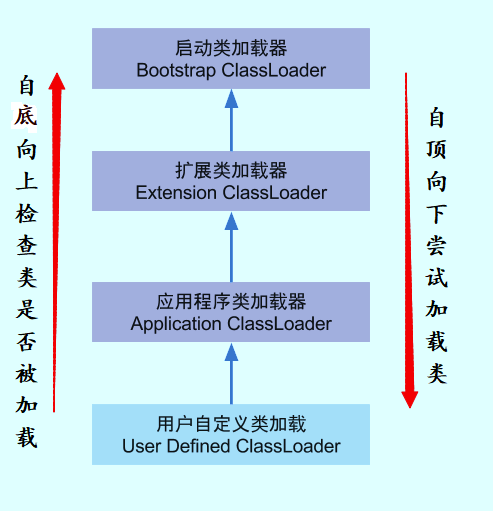

# 1、双亲委派机制

## 1.1、**类加载器**

- 启动类加载器

  ```
  BootstrapClassLoader
  ```

  - 最顶层的加载类，由 C++实现，负责加载 `%JAVA_HOME%/lib`目录下的 jar 包和类或者被 `-Xbootclasspath`参数指定的路径中的所有类。

- 扩展类加载器**

  ```
  ExtensionClassLoader
  ```

  **

  - 主要负责加载 `%JRE_HOME%/lib/ext`目录下的 jar 包和类，或被 `java.ext.dirs`系统变量所指定的路径下的 jar 包。

- 应用程序类加载器**

  ```
  AppClassLoader
  ```

  **

  - 面向我们用户的加载器，负责加载当前应用 classpath 下的所有 jar 包和类。

## 1.2、**双亲委派概念**

在Java类加载过程中，总是会去判断当前类是否能够由父类完成加载。如果父类能够完成加载则交由父类，如果父类不能完成加载，则会判断启动类加载器是否能完成加载，如果能则交由启动类加载器加载。如果不能则有自己加载。**总结来说就是每次类加载都交由上层的类1.3、加载器进行加载，如果上层的无法加载再自行加载；**这样保证了系统核心类不会被篡改。

1.3、打破双亲委派机制 如需要打破双亲委派机制，需实现一个自定义类加载器，继承`ClassLoader`类。如果不想打破双亲委派机制，则重写`findClass`方法即可。如果要打破双亲委派机制，则需重写`loadClass`方法；
